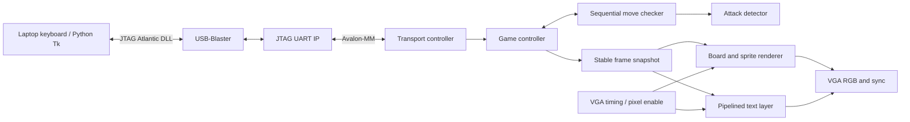

# Implementation and interfaces

## Ownership

The laptop owns only input capture and link status. `game_controller.sv` owns
the committed board and turn. `move_checker.sv` creates a private trial position.
`attack_detector.sv` scans potential attackers and walks sliding-piece rays one
square per cycle. There is no software chess engine on the laptop during play.

## Position encoding

A 256-bit packed board has a four-bit field at `square*4`. Square 0 is a1; square
63 is h8. Low three bits are 0 empty, 1 pawn, 2 knight, 3 bishop, 4 rook, 5 queen,
6 king. Bit 3 is 1 for Black. Empty squares are all zero.

Castling-right bits are white kingside, white queenside, black kingside, black
queenside. En passant has a valid bit and a six-bit destination square. The move
checker receives a board, side, rights, en passant state, source, destination,
and promotion request; inputs remain stable until `done`.

## Legality

Candidate movement is checked first. Sliding paths are walked sequentially.
The checker applies captures and special moves in its trial board and scans for
attacks on the moving king. Castling separately checks the original, transit,
and final king positions. En passant removes the captured pawn before scanning.
Attacks are geometric, not recursively defined in terms of legal moves.

On selection, the controller checks all 64 destinations and builds a bitmask.
On a committed move, it checks the opponent's king and searches for any legal
reply. It stops at the first reply; if none exists it reports checkmate or
stalemate. One queen-promotion representative suffices for existence testing
because all promotions occupy the same destination and affect own-king safety
identically. Actual promotion accepts all four pieces.

## Transport protocol

Each byte is a complete command: `w`, `s`, `a`, `d` move; `e` selects/confirms;
`x` cancels; `1`..`4` select queen/rook/bishop/knight; `!` restarts; `?` is a no-op
link probe. The FPGA echoes each consumed byte exactly once. Echo confirms input
delivery, not move legality; illegal destinations deliberately leave the board
unchanged. The status/board are displayed on VGA, not transmitted to the laptop.

The Avalon controller holds reads/writes through `waitrequest`, checks read-valid
bit 15, and checks transmit FIFO free space before writing. It holds a pending
command until the game is ready. The host permits only one outstanding command,
waits up to three seconds for its echo, and stops on an uncertain timeout rather
than retransmitting a possibly consumed command.

## Display

The active raster is 640x480, total 800x525, at 25 MHz pixel enable. All logic
runs on the same 50 MHz clock; there is no internally generated fabric clock.
Board squares are 48x48 pixels in a 384x384 board at (24,64). Original 32x32 piece
sprites are centered in each square. The sidebar is reserved for players,
status, promotion choices and keyboard instructions.

Game state is copied at the start of vertical blank only when the engine is
idle or awaiting promotion. This prevents partial legal masks or trial boards
appearing on screen. Four rendering stages align registered RGB and sync with
the three-stage text lookup. Piece data is initialized from `assets/pieces.mem`;
the text font is generated by `tools/generate_assets.py`.

## Timing boundaries

`chess.sdc` constrains the 50 MHz system clock and registered board outputs.
The asynchronous human reset input is excluded and synchronized. Quartus applies
its internal JTAG clock constraints. Reserved JTAG TDI/TMS/TDO ports may still be
reported as lacking external I/O delays; these are vendor debug-interface paths,
not unconstrained game/VGA clocks. Review `build/unconstrained_paths.txt` alongside
the timing summary. Do not claim complete external JTAG timing sign-off from the
core timing result alone.

The build refuses a negative reported slack or any critical warning and writes
a hash manifest. `tools/program.py` verifies the manifest and requires exactly
one detected MAX 10 target before invoking volatile SRAM programming.
