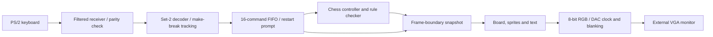

# DE2-115 chess: PS/2 keyboard and blue cursor

## Start

1. With the board off, connect a native PS/2 keyboard and the VGA monitor.
2. Power the board and attach USB-Blaster to the laptop.
3. Run `python tools/program.py --board de2-115`, or load
   `output_files/de2_115/chess_de2_115.sof` in Quartus Programmer.
4. Play using the keyboard attached to the board. No laptop application is needed.

Programming loads volatile SRAM only. Power cycling requires reprogramming;
configuration flash is unchanged.

| Key | Action |
|---|---|
| Arrows / WASD | Move the blue cursor |
| Enter / Space | Select a piece or confirm a destination |
| Esc | Cancel selection or promotion |
| 1 / 2 / 3 / 4 | Promote to queen / rook / bishop / knight |
| F2 | Show NEW GAME; Enter confirms, Esc cancels |
| Board KEY0 | Immediate reset and clear keyboard diagnostics |

Holding movement keys repeats at a controlled rate. Other commands require release
and another press. Main Enter and keypad Enter work. The restart modal also works
during promotion and after a result. Gold piece-selection and last-move highlights
remain distinct from the blue border.

## Hardware path



No soft CPU, JTAG UART, laptop controller, or external memory is included in the
DE2-115 build. All rules and graphics run on the FPGA.

## PS/2 implementation

`ps2_receiver.sv` samples clock and data through two-register synchronizers on
the 50 MHz system clock. An eight-sample clock filter rejects short glitches.
Falling-edge events receive start, eight LSB-first data bits, odd parity, and stop.
Bad parity/stop frames are discarded; a 2 ms missing-edge timeout discards partial
frames. Both PS/2 signals are inputs, so the FPGA never actively drives them.

`ps2_decoder.sv` handles E0, F0 and E1 prefixes, key releases and keyboard BAT.
Unrecognized keys produce no commands. The Pause sequence is ignored as a whole.
Prefixes expire after 20 ms. Movement typematic is limited to one event per 120 ms;
action keys emit once until released. BAT or frame errors clear held-key state.

This receive-only implementation assumes a native keyboard's power-on defaults:
scan-code set 2 and scanning enabled. It does not issue host commands or manage
Caps/Num/Scroll Lock LEDs. A passive adapter does not turn a USB-only keyboard
into a PS/2 device.

## Command adapter and reset

The decoder reuses `w/s/a/d/e/x/1/2/3/4`. F2 produces `r`, intercepted by
`keyboard_commands.sv`. During the modal, Enter resets the game and flushes
queued input; Esc resumes the unchanged position, selection or promotion.
Movement commands are ignored until the modal closes. F2 does not reset the
decoder, preserving held-key suppression across confirmation.

A 16-entry FIFO holds events while the chess engine is busy. Overflow drops the
newest event and sets LEDR8; it never overwrites older queued commands.

## VGA

The system remains at 50 MHz with a 25 MHz pixel enable. The 640x480 raster has
800x525 total pixels. `de2_vga_output.sv` forwards the DAC clock on the falling
system-clock edge, leaving setup time after RGB/blank registers update. Each
four-bit channel is replicated to eight bits: `12'h36f` becomes `24'h3366ff`.
HS/VS receive a one-pixel delay for the ADV7123's conversion pipeline; blanking
is sampled by the DAC with RGB. Composite sync is fixed at the separate-sync
configuration level.

The renderer's `CURSOR_RGB` and `PS2_CONTROL` parameters select the blue border
and PS/2 footer. Defaults preserve the DE10-Lite appearance. The restart message
and committed game position are sampled at frame boundaries.

## Board pins

`tools/board_config.py` generates `chess_de2_115.qsf` and validates the fitter's
physical `.pin` report. Target device: **EP4CE115F29C7**.

| Signal | FPGA pin | Standard |
|---|---|---|
| CLOCK_50 | Y2 | 3.3-V LVTTL |
| KEY0 | M23 | 2.5 V |
| PS2_CLK | G6 | 3.3-V LVTTL |
| PS2_DAT | H5 | 3.3-V LVTTL |
| VGA_CLK | A12 | 3.3-V LVTTL |
| VGA_BLANK_N | F11 | 3.3-V LVTTL |
| VGA_SYNC_N | C10 | 3.3-V LVTTL |
| VGA_HS / VGA_VS | G13 / C13 | 3.3-V LVTTL |

The second PS/2 pair (G5/F5) is for a splitter's second peripheral and is unused.
The first ten red LEDs are 2.5 V outputs. Unused pins are tri-stated inputs.
Mappings were checked against the installed Terasic DE2-115 System CD.

## Diagnostics

| LED | Meaning |
|---|---|
| LEDR0 | Toggles when a decoded command is consumed |
| LEDR1 | Black to move |
| LEDR2 / 3 / 4 | Check / checkmate / stalemate |
| LEDR5 | Promotion menu |
| LEDR6 | Chess engine busy |
| LEDR7 | Restart confirmation pending |
| LEDR8 | Input queue overflow, sticky until KEY0 |
| LEDR9 | PS/2 frame/parity/timeout error, sticky until KEY0 |

If keys do nothing, verify the keyboard is attached to the board, not the laptop.
Connect it before powering on; try KEY0 after keyboard startup. Repeated LEDR9
errors point to the keyboard, connector, or cable. The board may display a game
even with no keyboard attached; only LEDR0/manual response verifies reception.

## Build, tests, and package

```powershell
python tools/build.py --board de2-115
python tools/test.py --reference
python tools/render_preview.py --board de2-115 --mode 4
python tools/package_demo.py --board de2-115
```

Requires Quartus Lite 25.1 with Cyclone IV E support; tests require Icarus Verilog
and the development-only python-chess package described in the main README.
Reports are in `output_files/de2_115` and `build/de2_115`. Build verification
checks timing, critical warnings, unconstrained clocks/ports, pin placements,
and source/bitstream hashes. The programmer verifies the manifest and JTAG ID.

Simulation passes 68,480 independent chess-reference cases and the existing game
regression. New tests cover PS/2 filtering/framing/parity/timeout, prefixes,
make/break suppression, typematic limits, Pause, reboot, buffering/overflow,
restart confirmation/cancellation during play and promotion, queue flushing,
and DAC clock/RGB/control outputs. Renderer previews come from RTL simulation.

Not included: AI, clocks, undo, move history, repetition/move-count draw rules,
dead-position adjudication, online play, or keyboard LED control.

References: [Terasic DE2-115 manual](https://www.terasic.com.tw/attachment/archive/502/DE2_115_User_manual.pdf),
[ADV7123 datasheet](https://www.analog.com/media/en/technical-documentation/data-sheets/adv7123.pdf).

## Final compilation — 9 September 2026

- Quartus Prime Lite 25.1std.0, EP4CE115F29C7.
- **8,042 / 114,480 logic elements (7%)**, 1,854 registers, 32,816 memory bits.
- Worst 50 MHz setup slack **+4.025 ns**; DAC output setup slack **+4.665 ns**
  at the slow 85 C corner. All reported corner slacks are nonnegative.
- Zero unconstrained clocks, input ports, or output ports.
- Full compile: zero errors, eight noncritical warnings. Timing Analyzer:
  zero errors and zero warnings.
- Pin placements checked against all 43 declared board signals.
- Remaining warnings concern unused sprite ROM write inputs, the intentionally
  constant DAC sync input, Lite feature notices, default I/O drive/slew settings,
  and board I/O voltage notices.
- Source and bitstream hashes: `output_files/de2_115/build_manifest.json`.
- Blue border and restart prompt visually checked in the actual RTL-rendered image.

The attached USB-Blaster reports ID `020F70DD`, matching the configured DE2-115
target. Quartus successfully programmed the final `.sof` at 15:55 on 9 September
2026, with zero programming errors or warnings. The loaded image checksum was
`0x00A7EE3D`. This changed volatile FPGA SRAM only.

The user confirmed that the physical VGA display, blue cursor, PS/2 movement and
selection, and F2/Esc restart prompt all work on the DE2-115. Full chess-rule and
restart-confirmation coverage is additionally provided by simulation; this is
not a claim that every special move was manually exercised on the new board.

## Automatic board rotation

The DE2-115 enables `AUTO_FLIP` on the game controller and renderer. White starts
at the bottom; each committed move switches the orientation to the next player.
Board squares, coordinate labels, cursor, legal destinations, check and last-move
highlights use the same orientation. Piece sprites remain upright. Arrow keys
and WASD follow screen directions. Promotion retains the current orientation
until the choice commits; cancellation does not rotate. Restart restores White.

The engine keeps canonical a1=0 square indices. Rendering reverses both axes for
Black; input reverses both movement axes. The existing frame snapshot captures
the board and side together after move processing, avoiding mid-frame rotation.
The legacy DE10-Lite uses the default fixed orientation.

Verification: game regression runs in both fixed and automatic modes, including
Black-view edge bounds, alternating turns, invalid moves, promotion/cancellation,
and restart. Renderer checks all 64 square mappings and 16 coordinate labels in
both orientations. `python tools/render_preview.py --board de2-115 --mode 5`
generates the Black-view preview after e2-e4 with e7 selected.

### Rotation build and programming — 9 September 2026

Quartus compilation, timing and all 43 pin checks passed. The updated design uses
8,087 logic elements (7%), 1,854 registers and 32,816 memory bits. Slow 85 C setup
slack is +3.396 ns for clk50 and +4.019 ns for the VGA DAC. All checked timing
corners pass, with no unconstrained clocks or I/O ports.

The updated image was programmed successfully at 16:09, checksum `0x00AAE51E`,
with zero programmer errors or warnings. Physical automatic-rotation confirmation
is pending; the earlier hardware confirmation above predates this feature.
